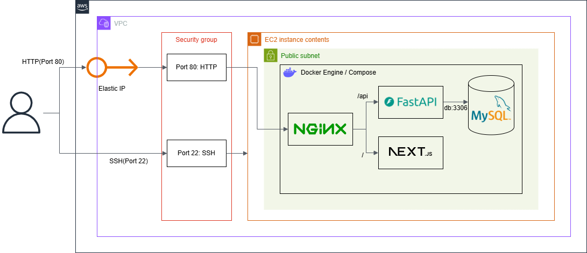
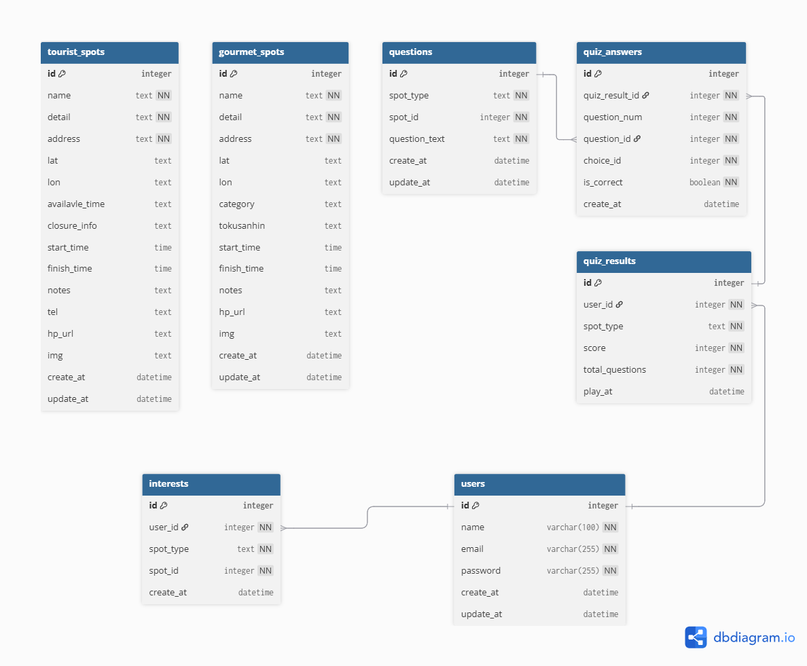

# クイズ彩の国
「埼玉県は東京のベッドタウン」という認識を払拭するために、埼玉県の観光地・グルメについて知ってもらうためのクイズアプリです。


# 🛠 技術スタック
## 💻 フロントエンド
- **言語**：TypeScript
- **フレームワーク**：Next.js
- **UI**：React + Tailwind CSS
- **HTTP クライアント**：Fetch API

## ⚡ バックエンド
- **言語**：Python
- **フレームワーク**：FastAPI
- **ORM**：SQLAlchemy
- **マイグレーション**：Alembic

## 🗄 データベース
- MySQL 8.0

## 🐳 開発環境
- Docker
- Docker Compose

## ☁️ インフラ（AWS）
- EC2
- VPC
- Elastic IP
- Security Group

## 🛡 リバースプロキシ
- Nginx


# 🏗 システム構成図
AWS上にDockerコンテナをデプロイし、Nginxでルーティングを行う構成です。



# データベース設計
データの永続化にはMySQLを使用し、Alembicでマイグレーション管理を行っています。

詳細な定義は [schema.dbml](./docs/schema.dbml) を参照してください。


# 🚀セットアップ
## 前提条件
- Docker
- Git

## 1. リポジトリをクローン
```Bash
git clone https://github.com/siw-nexus/quiz-sainokuni.git
cd quiz-sainokuni
```

## 環境変数の追加
1. `.env`ファイルの作成
    ```Bash
    # ルートディレクトリの.env
    cp .env.sample .env

    # バックエンドの.env
    cp ./backend/.env.sample ./backend/.env

    # フロントエンドの.env.local
    cp ./frontend/.env.sample ./frontend/.env.local
    ```
2. `.env`ファイルの必要な値を記述
    1. 以下のコマンドの結果を`./backend/.env`の`SECRET_KEY`に張り付け
        ```Bash
        openssl rand -hex 32
        ```
    2. `ルートディレクトリ`に作成した`.env`の`MYSQL_ROOT_PASSWORD`と`MYSQL_PASSWORD`を書き換えてください。

## コンテナの起動
- 本番用
    ```Bash
    docker compose -f docker-compose.yml -f docker-compose.prod.yml up -d --build
    ```
- 開発用
    ```Bash
    docker compose up -d
    ```

## コンテナの停止
アプリケーションを停止し、コンテナを削除する場合は以下のコマンドを実行してください。
```Bash
docker compose down
```
データベースのデータ（ボリューム）も完全に削除して初期化したい場合は、以下のコマンドを実行してください。  
```Bash
docker compose down -v
```

## ブラウザでアクセス
- フロントエンド：http://localhost
- バックエンド：http://localhost/api/docs （Swagger UI）


# 📂 ディレクトリ構成
```PlainText
├── backend/                # FastAPI (Python) ソースコード
├── frontend/               # Next.js (TypeScript) ソースコード
├── nginx/                  # Nginx 設定ファイル
├── docker/mysql/           # テスト用データベースの設定ファイル
├── mysql_conf/             # データベースの設定ファイル
├── docs/                   # 構成図・ER図・DBML
├── docker-compose.prod.yml # 本番用のコンテナ定義ファイル
└── docker-compose.yml      # 開発用のコンテナ定義ファイル
```


# ✨ こだわりポイント
- **パスベースルーティング**: Nginxを活用し、`/` をフロントエンド、`/api` をバックエンドへ振り分けることで、単一ドメインでの運用とCORS問題の回避を実現しました。
- **インフラのコード化**: Docker Compose を用いて、DBからWebサーバーまで一貫した環境を1コマンドで構築可能です。
- **環境構築の完全自動化**: `docker compose up` を実行するだけで、Alembicによるマイグレーション（テーブル作成）と、初期データ（マスターデータ）の投入が自動で行われるよう設計しました。これにより、データベースの手動操作なしで、即座にクイズアプリを試せる環境を実現しています。
- **型安全な設計**: TypeScriptとFastAPIを採用し、フロント・バックエンド両面で堅牢な開発基盤を整えています。